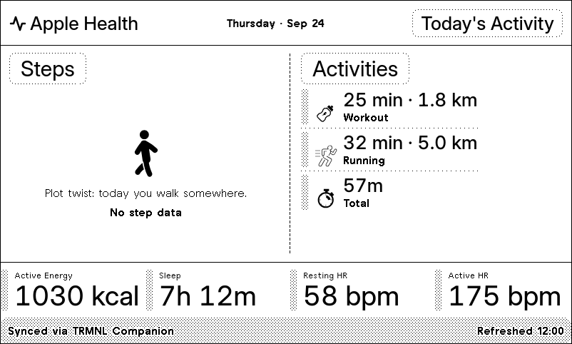
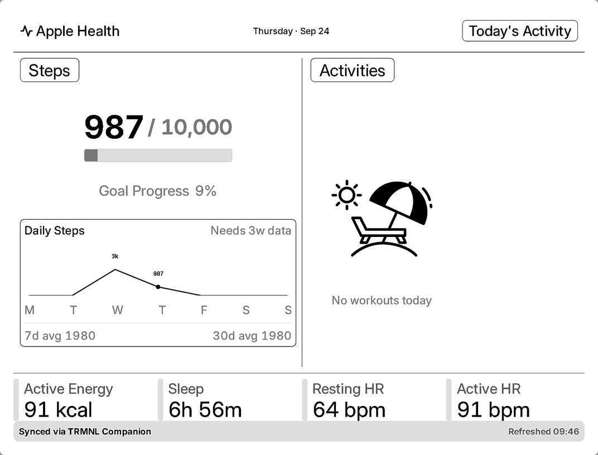
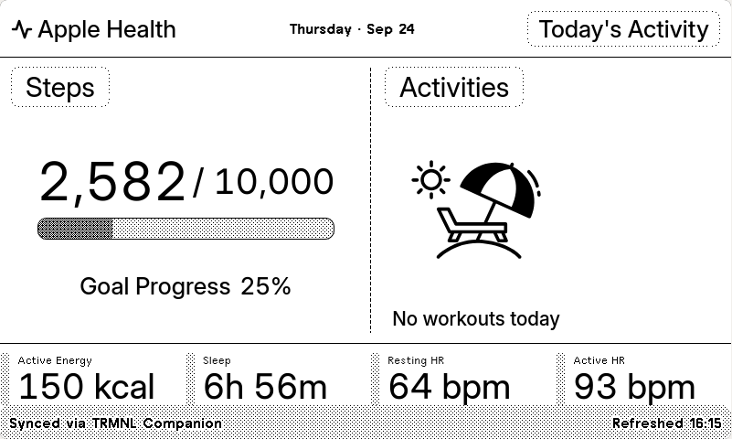
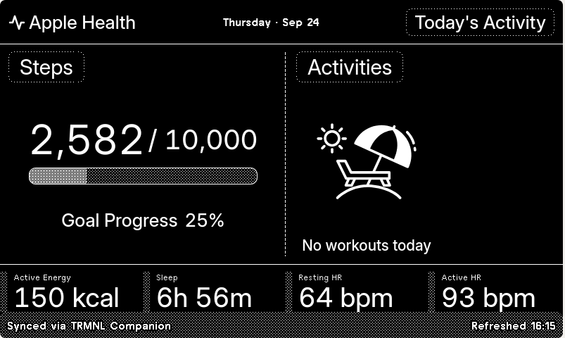

# Apple Health for TRMNL

An [Apple Health](https://www.apple.com/ios/health/) plugin for [TRMNL](https://usetrmnl.com) — steps, active energy, sleep, resting/active heart rate, and today's workouts on your e-ink display.

Shown on the display: today's steps against a 10,000 goal (with a 7-day
trend), workouts, and a bottom row of active energy, sleep, resting and
active heart rate.

| playlist |
| --- |
|  | 

| e-ink | e-ink (dark) |
| --- | --- |
|  |  |

## How it works

- **Strategy: webhook.** The [TRMNL Companion app](https://usetrmnl.com/companion) (iOS) reads Apple Health via HealthKit and POSTs the raw payload — `{ health: { metrics: [...], workouts: [...] } }` — to this plugin's webhook URL on each sync.
- **`Serverless`** reduces that raw payload into the merge variables the views use: deduplicates overlapping multi-source samples (iPhone + Watch double-counting), windows everything to the user's local calendar day via `trmnl.user.utc_offset`, and computes derived stats (max heart rate during activity, resting HR from overnight samples, total active energy across background + workout streams).
- **`Liquid Templates`** render four sizes — `full`, `half_horizontal`, `half_vertical`, `quadrant` — sharing common logic and hand-drawn monochrome icons.
- A rolling **30-day trend history** is kept in TRMNL's per-install state store (`trmnl.state`), written each sync, for future week-over-week comparisons.

## How to Setup

This plugin has no polling URL or API key — Apple Health data only reaches TRMNL through the [Companion app](https://apps.apple.com/us/app/trmnl-companion/id6752111280) (iOS), which reads HealthKit on-device and pushes it to this plugin's webhook.

1. **Install TRMNL Companion** from the App Store, and sign in with your TRMNL account.
2. **Install the plugin in TRMNL** enable **Webhook** strategy.
3. **Grant Health permissions.** In Companion, pull down on the Plugins tab to refresh, then select this plugin. Health data types appear in a dropdown — enable the ones you want shared (steps, heart rate, sleep, active energy, workouts, etc.); each can be toggled independently.
4. **Background sync** happens automatically after that — but per TRMNL's own docs, it can pause if you force-close the Companion app, and HealthKit background delivery isn't guaranteed to be frequent.

### Regular sync via Apple Shortcuts

For a more reliable, predictable sync cadence than background delivery alone, set up a scheduled Shortcuts automation that explicitly triggers a sync:

1. Open the **Shortcuts** app → **Automation** tab → **New Automation**.
2. Choose a **Time of Day** trigger (e.g. daily at a fixed time) — other trigger types are available if you want a different cadence.
3. Add the **Sync to TRMNL** action from TRMNL Companion to the automation.
4. Optionally disable "Ask Before Running" / notifications for this automation so it runs silently in the background.

This is the same mechanism TRMNL recommends for [keeping Calendar plugins in sync](https://help.trmnl.com/en/articles/12294875-trmnl-companion-for-ios) more frequently than passive background sync alone — it applies equally to Health.