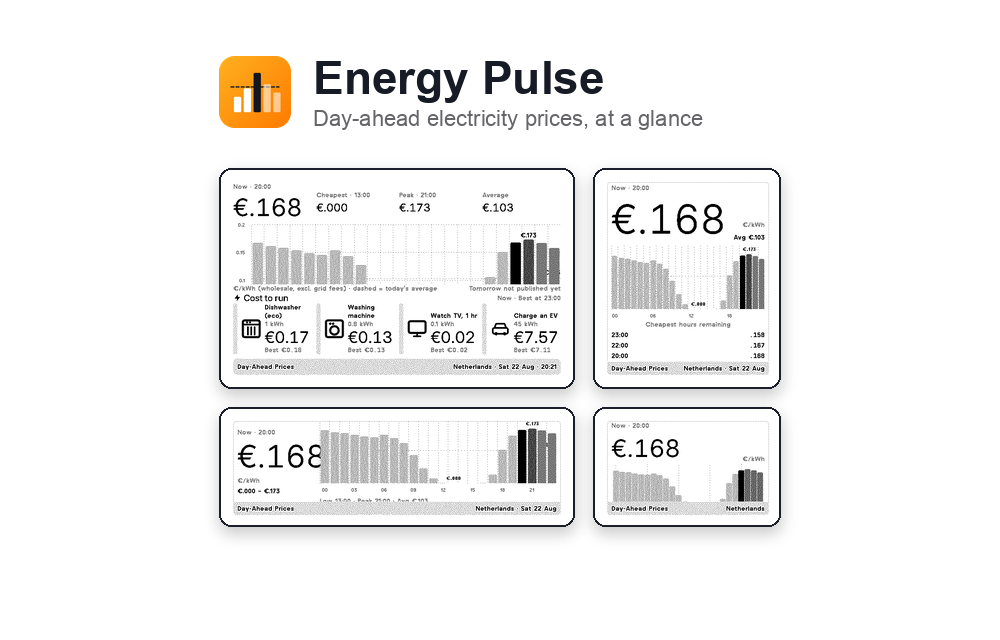
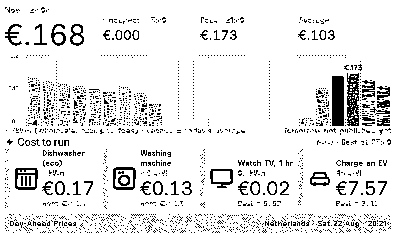
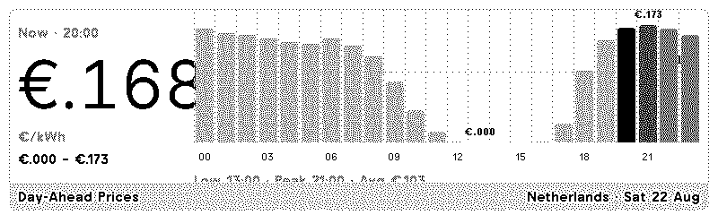
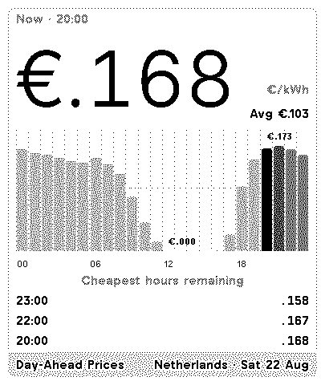
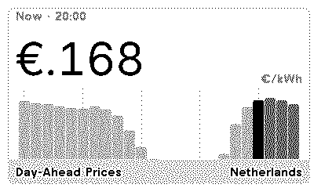

# Day-Ahead Energy Prices

A TRMNL plugin that shows **today's hourly day-ahead electricity
prices** for a European bidding zone, ultimately sourced from the
[ENTSO-E Transparency Platform](https://transparency.entsoe.eu) via
a small API service this plugin polls directly.

> **Coverage:** ENTSO-E markets only — EU, UK, Norway, and Switzerland. Not
> available for the US or other non-ENTSO-E regions.





All four layouts are implemented — `full`, `half_horizontal`, `half_vertical`
(which also lists the cheapest hours still ahead) and `quadrant`. The bar for
the current hour is solid black, past hours are lighter than future ones, and
the dashed line marks today's average.

The `full` view carries a row of **usage examples** under the chart — what a
few common loads cost at the price right now, and what the same load would
cost at the cheapest hour still to come. It's the "wait until 23:00 and this
EV charge is €1.28 cheaper" nudge that a wholesale price alone doesn't give
you.

| half_horizontal | half_vertical | quadrant |
| --- | --- | --- |
|  |  |  |

> Screenshots use synthetic prices, not live data.

## Settings

| Field | Notes |
| --- | --- |
| Country | 18 ENTSO-E countries/markets. Default Netherlands. |
| Zone | Only shown for countries with multiple pricing zones (Great Britain, Italy, Denmark, Norway, Sweden). Options load live, scoped to the chosen country, from the plugin backend's `/api/v1/zones` endpoint — 33 zones total (EIC-coded, plus 14 GB regions keyed by GSP letter — see Caveats). |
| Price unit | `€.179/kWh` (default), `17.9 ct/kWh`, or `179 EUR/MWh`. |
| Usage examples | Optional. One `Label = kWh` per line; `off` hides the row. |
| VAT % | Optional; applied on top of the wholesale price. |

### Usage examples

Leave the field blank and you get four defaults, with consumption figures:

```
Dish washer, 10 min = 6
Washing machine = 0.8
Watch Tv = 1.1
Charge an EV = 45
```

Override it with whatever you actually run — the right-hand side is kWh, the
left is free text:

```
Kettle = 0.12
Tumble dryer = 2.5
Heat pump, 1 h = 3
Sauna = 8
```

Costs are always in the market's own currency (with VAT if set), independent
of the *Price unit* setting. Anything under one cent renders as `<0.01`.

### A note on the price unit

ENTSO-E publishes in currency per MWh. The default display converts that to
**currency per kWh, three decimals, currency sign in front** — `€.179/kWh`.
Since per-kWh prices are almost always under €1, the leading zero is dropped
(`.179`, not `0.179`) to buy back a character for the 24-column chart. Values
that do reach €1+ keep their leading digit (`€1.974`). The chart captions
carry no sign at all (`.179`); the tiles and summaries do, and a negative
price reads `-€.013`, not `€-.013`.

Changing `default:` in `settings.yml` only affects *new* instances. For an
existing one, change the field in the TRMNL UI; for local dev, edit
`custom_fields.price_unit` in `.trmnlp.yml`, which overrides the default.

## What the backend handles

All of the awkward parsing done by the API backend service

- **Raw XML.** ENTSO-E answers with a namespaced `Publication_MarketDocument`;
  the backend walks it directly with `xml.etree.ElementTree`.
- **Mixed resolutions.** Several zones publish `PT15M` alongside `PT60M` since
  the 2025 MTU change. Native hourly points win; any remaining hour is filled
  from the average of its quarter-hour MTUs.
- **DST.** The local day is walked in UTC between two local midnights, so
  transition days correctly produce 23 or 25 bars.
- **Negative prices.** Bars are drawn from `min(0, cheapest)` and a solid zero
  line appears when any hour goes negative.
- **Failures.** A fetch or parse failure (bad token, no data) is turned into a
  readable empty state instead of a blank screen.
- **Caching.** Each bidding zone's ENTSO-E response is cached for the
  day, so repeated polls (from this plugin or others) don't hammer the API.

The response this plugin receives is already a flat structure: `ok`,
`hours[]` (with `price`, `display`, `pct`, `is_now`, `is_past`, `is_min`,
`is_max`, `negative`), `stats`, `tomorrow`, `usages[]` (`label`, `kwh`, `now`,
`best`), `best_time`, `currency_symbol`, `unit_label`, `zone_label`,
`date_label` — the Liquid views consume it as-is.

## Development

Local dev runs `trmnlp` via Docker (see the repo-root `Makefile`) — no local
Ruby install needed:

```bash
make lint PLUGIN=energy_pulse
make serve PLUGIN=energy_pulse        # http://localhost:4567
```

Run these from the repo root; `PLUGIN` is required and selects the plugin
directory. `serve` polls whatever `polling_url` is set to in `.trmnlp.yml`

## Caveats

- **Europe/ENTSO-E only.** Bidding zones cover the EU, UK, Norway, and
  Switzerland. The US and other non-ENTSO-E markets use different data
  sources entirely and aren't supported.
- Prices are **wholesale day-ahead**, not a retail tariff — no grid fees,
  levies or supplier margin. The VAT field is the only markup applied.
  **Exception: Great Britain.** ENTSO-E has carried no GB day-ahead data
  since Brexit, so GB zones are backed by Octopus Energy's public Agile
  tariff instead — a **retail** unit rate (network costs and supplier
  margin included, VAT excluded) for the selected GSP region, not a
  GB-wide wholesale price.
- Tomorrow's prices don't exist before the day-ahead auction clears, so the
  footer says so rather than showing stale numbers.
- `refresh_interval` is one hour, which keeps the "Now" tile honest and picks
  up tomorrow's publication without hammering the API.
