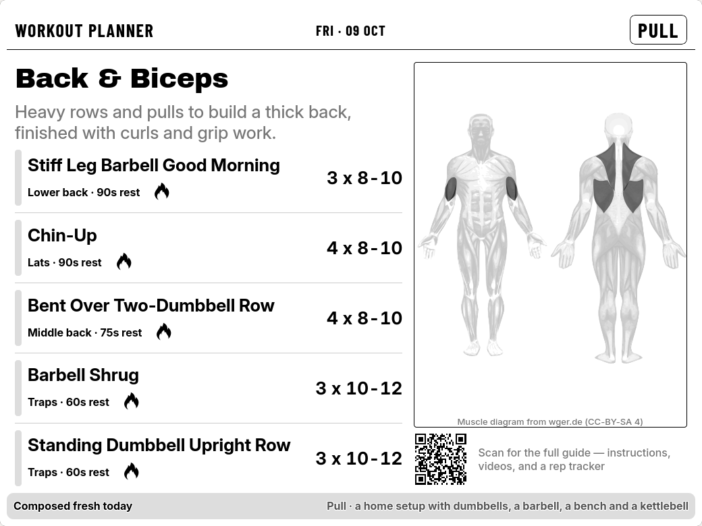
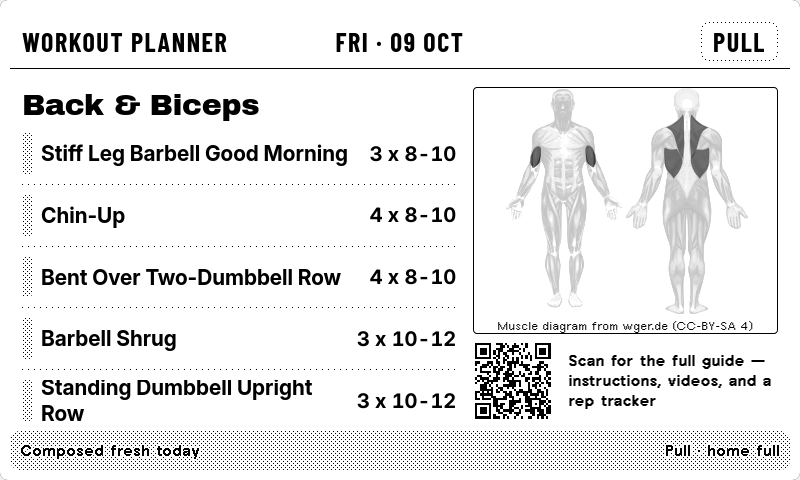
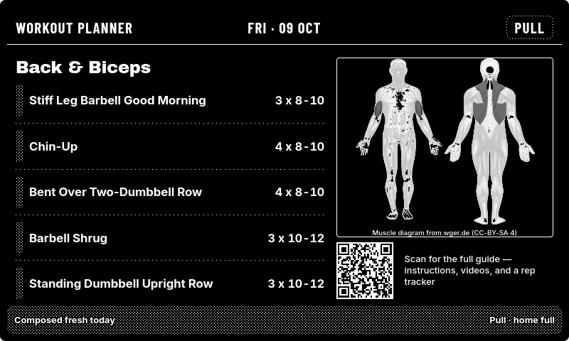
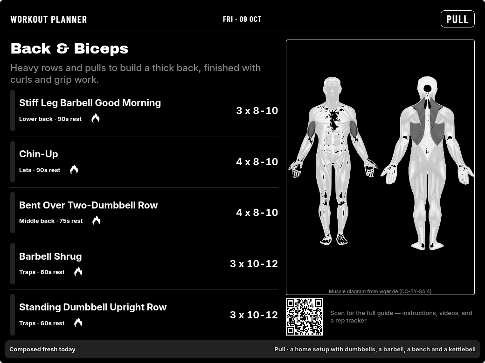
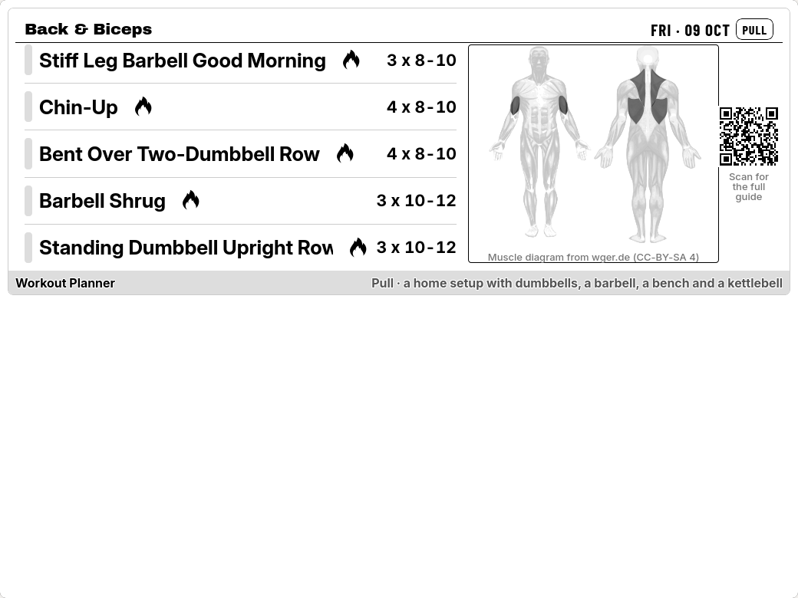
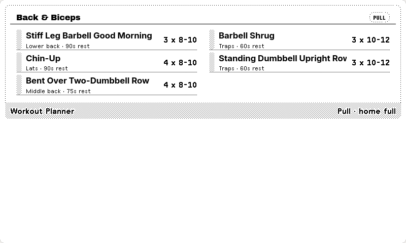
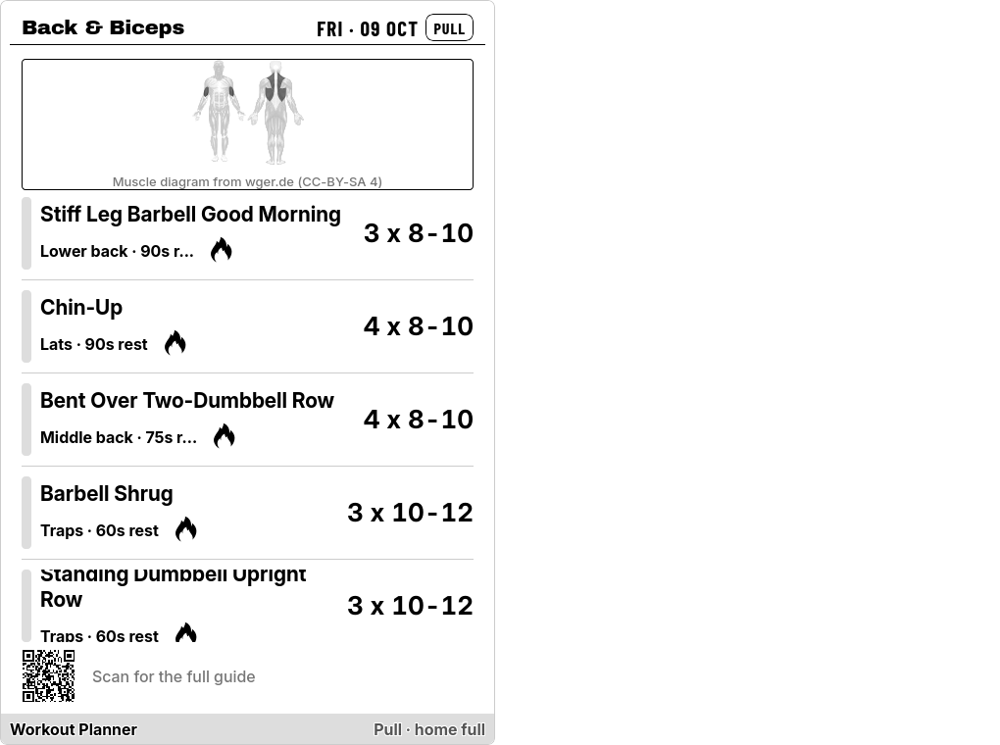
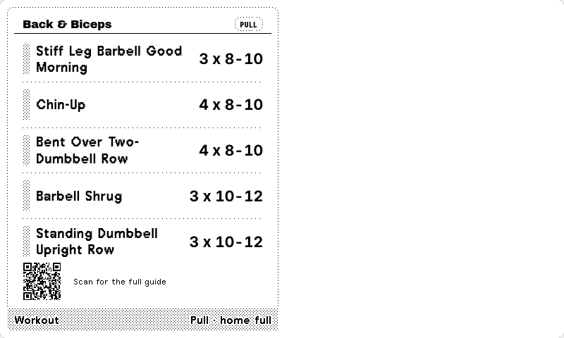
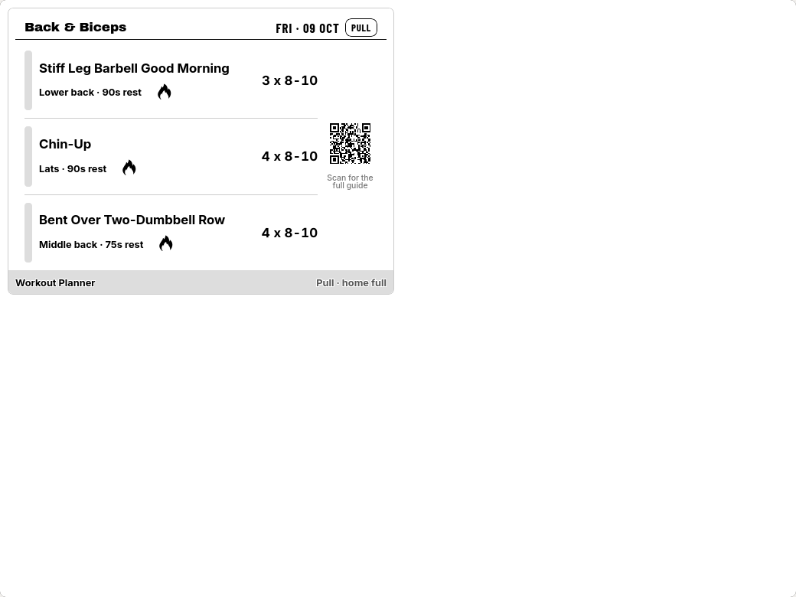
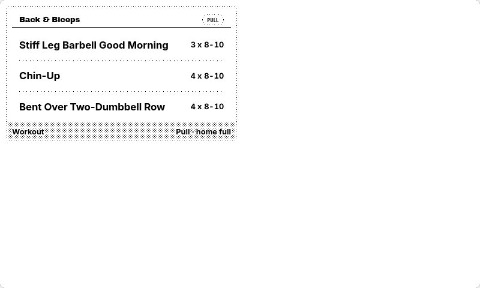

# Daily Workout Planner for TRMNL

A [TRMNL](https://usetrmnl.com) plugin that puts a fresh workout on your e-ink display every day. Skip the planning. Just train.



Shown on the display: today's workout with five exercises, their sets and reps, rest time and difficulty, plus a muscle diagram of what you are training. Scan the QR code on the display for the full guide with instructions, form videos and a rep tracker.

| TRMNL OG | TRMNL OG (dark) |
| --- | --- |
|  |  |

| TRMNL X (dark) |
| --- |
|  |

Every layout size is supported, on both TRMNL X and TRMNL OG:

| layout | TRMNL X | TRMNL OG |
| --- | --- | --- |
| half horizontal |  |  |
| half vertical |  |  |
| quadrant |  |  |

## What you get

- **A new workout every day** for the gym, for home, or for bodyweight only.
- **A weekly schedule** that picks the right workout for each day. Rest days show a short recovery checklist instead.
- **Variety.** The plan avoids repeating what you did in the last week.
- **A muscle diagram** that shows which muscles today's workout trains.
- **Form videos and a rep tracker**, one QR scan away.
- **All four layouts**, on TRMNL OG and TRMNL X, in landscape and portrait.

## Workouts

Push, Pull, Legs, Full body, Core, Fat burn, and Stretch & mobility.

## How to Setup

1. **Add the plugin** to a playlist in TRMNL.
2. **Pick a schedule** (see below).
3. **Pick your equipment**: Gym, Home, or Bodyweight only. For Home, also choose what you have: dumbbells only, or dumbbells + barbell + bench + kettlebell.
4. Done. A new workout appears each day, following your TRMNL account's time zone.

### Schedules

| Schedule | Training days |
| --- | --- |
| Push / Pull / Legs, 3 days *(default)* | Mon, Wed, Fri |
| Push / Pull / Legs + Core, 4 days | Mon, Tue, Thu, Fri |
| Push / Pull / Legs, 6 days | Mon to Sat (Sunday off) |
| Full body, 3 days | Mon, Wed, Fri |
| Custom week | You choose |

Days that are not training days are rest days.

### Custom week

Choose **Custom week** and fill in **Week plan** with seven entries, Monday to Sunday, separated by commas. Use `push`, `pull`, `legs`, `full_body`, `core`, `burn`, `stretch`, or `rest`.

```
push,pull,legs,rest,push,pull,rest
```

Use the same workout seven times for one routine every day.

## Credits and privacy

- Exercise data comes from the [Free Exercise DB](https://github.com/yuhonas/free-exercise-db) (public domain).
- The muscle diagram is built from artwork by [wger.de](https://wger.de), licensed [CC-BY-SA 4.0](https://creativecommons.org/licenses/by-sa/4.0/); the credit is shown on the display.
- No account or sign-up is needed. See the [privacy notice](https://w.spawnlab.dev/privacy).
